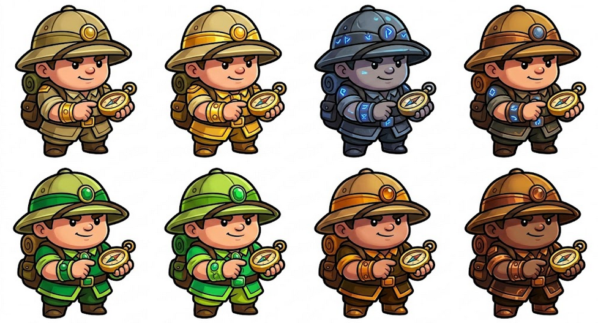

**user:**
 Set of 4 individual stout and chunky Chibi Jungle Explorer character tokens, arranged in a clean 2x2 grid on a white background.

Design: All 4 must have the exact same pose: a big head, a round pith helmet, a small backpack, and holding a golden compass.

The 4 skins matching previous assets:

Golden Theme: Khaki and bright golden-yellow outfit with gold metallic details.

Blue Stone Theme: Dark grey clothing with glowing sapphire blue runes and accents.

Green Jade Theme: Vibrant emerald green and lime outfit with jade gemstone ornaments.

Dark Copper Theme: Deep bronze and amber orange clothing with metallic copper textures.

Style: 2D hand-painted game art, extra thick clean outlines, vibrant saturated colors, professional mobile game UI asset. No text, no labels, no extra characters, high resolution." 

**Agente Gemini 3.1 Pro:**
