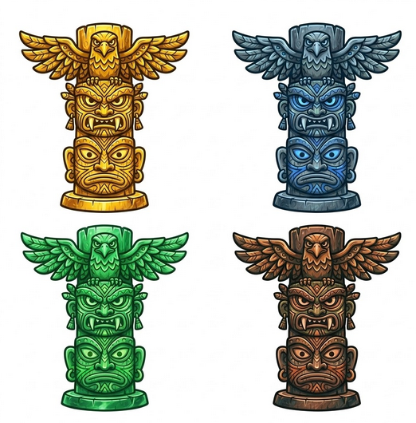

**user:**
Set of 4 individual 2D game tokens, arranged in a clean 2x2 grid on a white background. Each token is a stout and compact (chibi style) Ancient Jungle Totem with an eagle head and spread wings at the top and two stacked tribal masks.

The 4 material themes are:

Golden Wood: Polished gold and bright yellow tones.

Blue Stone: Ancient grey stone with glowing sapphire blue accents.

Green Jade: Vibrant emerald green and lime highlights.

Dark Copper: Deep bronze and metallic copper textures.

Style: Very cartoon style, squashed proportions, 2D hand-painted, extra thick clean outlines, vibrant saturated colors, no natural brown wood. All items must be fully visible and not cut off. High resolution game asset sheet. 

**Agente Gemini 3.1 Pro:**
